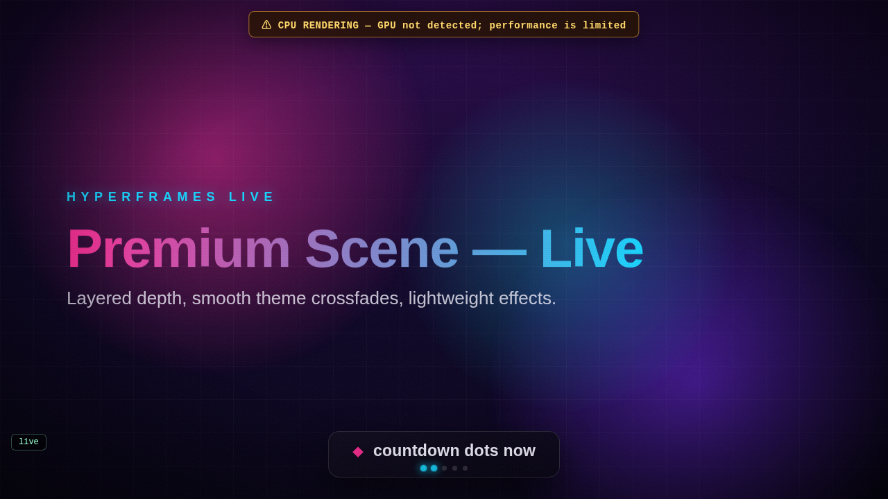
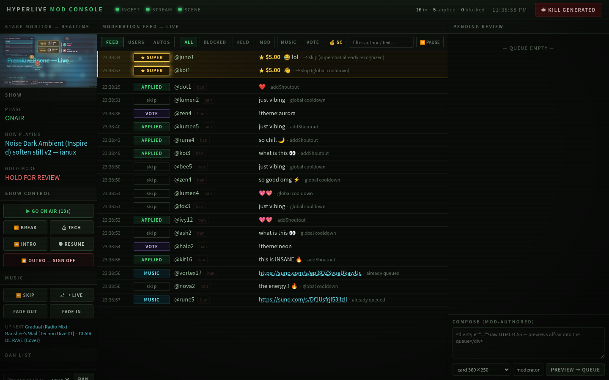
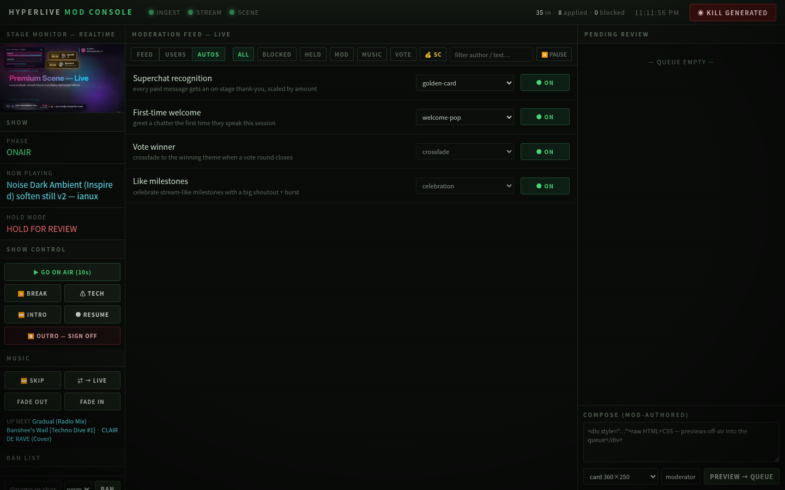

# HyperLive

A comment- and payment-driven **live YouTube channel** where viewers steer the
video in real time. Built on a [HyperFrames](https://github.com/heygen-com/hyperframes)-style
HTML/CSS/animation authoring model, but streamed live instead of rendered offline.

> Write HTML. Mutate it live from moderated chat. Stream it to YouTube.

**▶ [Watch a demo on YouTube](https://www.youtube.com/live/NjpZs7JjWIU)** <sub>(captured during a dev session)</sub>

[](https://www.youtube.com/live/NjpZs7JjWIU)

<sub>The live scene: kicker / gradient headline / subhead, the bottom pop-up cards with countdown dots, and (top) the on-screen warning shown when it auto-falls back to CPU rendering. Click to watch the demo.</sub>

## Try it in 3 minutes — no accounts, no keys

```bash
git clone https://github.com/imcmurray/hyperlive && cd hyperlive
docker compose -f docker-compose.demo.yml up --build
```

Then open **http://127.0.0.1:8090** and click **▶ GO ON AIR**.

A synthetic crowd (welcomes, theme votes, song requests, Super Chats — and
spam that gets blocked) drives the live scene while you moderate it from the
real dashboard: watch the stage react in the monitor (click it to pop out a
live player), ban the flooder, ack a superchat in the callout tray, preview an
automation off-air. Nothing leaves your machine — the full encode pipeline
runs but writes to `/dev/null` instead of RTMP, the "viewers" are a simulator,
and no GPU is assumed (pure CPU rendering). When you're done: `Ctrl-C`.

## The idea

- A long-lived **HTML/CSS/GSAP scene** renders in a real (headless) browser.
- A real-time **browser capture** (Xvfb + ffmpeg `x11grab`) pushes it to
  **YouTube Live** over RTMP — a single continuous stream.
- Viewers' **chat comments**, once moderated, become **scene directives**
  (`{action, params}`) that mutate the scene live.
- **Super Chats** escalate the effect by amount tier — small = shoutout,
  medium = scene change, large = a pre-rendered HyperFrames "takeover" clip.
- A **moderation gate** sits in front of everything; viewer input can only ever
  become *arguments* to pre-vetted actions, never executable markup. This is
  the project's one hard invariant, and it's enforced by a CI gate — see
  **[Safety & the adversarial test suite](#safety--the-adversarial-test-suite)**.

## Why this architecture (the key bet)

HyperFrames is a *deterministic, offline* HTML→MP4 renderer — fantastic for
polished clips, but a 30–90s render+buffer delay would kill live interactivity.
So the **live surface is a real-time captured browser scene** (low latency,
live DOM mutation), and HyperFrames' offline renderer is reserved for
high-quality **pre-rendered takeover clips**. See [`docs/phase0.md`](docs/phase0.md)
for the full rationale.

## Status

| Phase | What | State |
|-------|------|-------|
| **0** | Transport spike: live scene → x11grab → ffmpeg → YouTube RTMP, mutable while live | ✅ built + verified live (`packages/streamer`) |
| **1** | Comments → moderation gate → rule-based director → `/mutate` | ✅ built + verified live via simulator (`packages/ingest`); real YouTube polling ready, needs OAuth — see [`docs/phase1.md`](docs/phase1.md) |
| **2** | Swap the director's `parseIntent()` for a **Claude** call (same directive shape, re-validated) | ✅ built (`packages/ingest`, `DIRECTOR=llm`); needs `ANTHROPIC_API_KEY` to run — see [`docs/phase2.md`](docs/phase2.md) |
| 3 | Super Chat tiers → escalating effects + pre-rendered takeover clips | partial (tiers→shoutouts done; takeover clips pending) |
| 4 | Hardening: reconnect, watchdog, mod console (feed · bans · hold queue · kill switch) | ✅ done (1080p60 still pending) |

## Mod console

A self-contained, dependency-free moderator dashboard ships with the ingest
(`packages/dashboard`, served at **`http://127.0.0.1:8090`** while the ingest
runs — loopback-only by design; remote mods tunnel in via SSH/Tailscale
rather than trusting hand-rolled auth).



<sub>The main view mid-show: realtime stage monitor (click to pop out a live
player), the moderation feed with two gold superchats pinned in the callout
tray awaiting an on-air thank-you, show/music transport on the left, and the
hold queue + mod compose panel on the right.</sub>

What a moderator gets:

- **Live moderation feed** (SSE, with replay on reload): every chat event and
  its verdict — applied, held, blocked, or cooldown-skipped. Filter chips
  (mod / music / vote / 💰 superchat), author/text search, pause, and
  hover-freeze so rows hold still while you aim.
- **One-click overrides**: click a `skip` chip to apply a cooldown-skipped
  message anyway; approve or reject held messages from the pending queue;
  replay any applied directive.
- **Superchat pipeline**: paid messages render as gold rows, trigger automated
  on-stage recognition (card / shoutout / burst, scaled by amount tier), and
  pin to a pulsing callout tray until the host clicks ★ to mark them thanked
  on air. Follow-up pipeline events (queued song, callout) fold into the same
  row.
- **USERS view**: a directory of everyone who interacted this session — click
  through to their full history plus mute / unmute / kick (10 m) / timeout
  (1 h) / ban / unban. All enforced locally at the gate, so OAuth stays
  `youtube.readonly`; bans persist across restarts with expiring timeouts.
- **AUTOS view**: event → animation bindings. Toggle the builtin recognitions
  (superchat, first-time welcome, vote winner, like milestones) and pick their
  style, or add custom bindings — *(event, vetted action, params)* with
  `{who}`/`{amount}`-style placeholders, never code. Every automation can be
  **previewed off-air** into a scene twin the broadcast capture can't see,
  streamed back into a dashboard modal — test animations without watching
  (or polluting) the live stream.
- **Show operations**: the `live.sh` transport verbs as buttons (go on air,
  break, tech, intro, outro/sign-off), music controls (skip / fade / live
  mode) with an up-next queue and clickable song links, stream vitals in the
  top bar, and a guarded two-click kill switch.
- **Mod compose**: moderators author raw HTML/CSS cards that pre-render
  off-air (JS disabled, sandboxed) before being queued to the stage.



<sub>The AUTOS view: builtin recognitions with per-event style pickers and
on/off switches; custom automations appear below with off-air ▶ previews.</sub>

## Quick start (Phase 0)

```bash
# one-time on EndeavourOS/Arch: sudo pacman -S docker-compose
cp .env.example .env      # add your YouTube stream key, set DRY_RUN=false
docker compose up --build
# then, while it streams:
scripts/mutate.sh '{"action":"setTheme","params":{"theme":"forest"}}'
```

Full walkthrough + YouTube key setup + CPU notes: **[`docs/phase0.md`](docs/phase0.md)**.

## Layout

```
packages/
  streamer/   ✅ Phase 0: scene + browser capture + ffmpeg→RTMP + /mutate
  director/      Phase 2: Claude brain that emits validated directives
  ingest/        Phase 1/3: YouTube chat + Super Chat ingestion + moderation
  dashboard/  ✅ Phase 4: mod console — feed, users, automations, superchats, transport
docs/phase0.md   transport spike walkthrough
scripts/         mutate.sh / mutate-file.sh helpers
```

## Safety & the adversarial test suite

The whole bet of this repo is the **safe-template invariant**: untrusted
internet input can mutate a *live, broadcasting* DOM and **never** escape into
script execution. That's not asserted on faith — it's a regression gate.

```bash
npm test                  # validation logic: moderation gate, bans, automations
npm run test:adversarial  # fires an injection corpus at the REAL scene in a browser
```

The adversarial probe (`tests/adversarial/scene-probe.mjs`) loads the actual
scene in headless Chromium and throws ``, `<svg onload>`, inline
`<script>`, `javascript:` URLs, attribute break-outs, and oversized payloads at
every untrusted door — chat→`setText`, viewer cards, takeovers, automation
params, the `/mutate` endpoint. A global tripwire catches any parent-document
execution; it asserts the sandboxes hold, the clamps hold, and the gated
actions stay gated. Both run in CI on every push (`.github/workflows/ci.yml`).

Full threat model, trust boundaries, and the loopback/OAuth posture:
**[`SECURITY.md`](SECURITY.md)**.

## Credits & acknowledgements

HyperLive was inspired by and bootstrapped from
**[HyperFrames](https://github.com/heygen-com/hyperframes)** by
[HeyGen](https://github.com/heygen-com) — an open-source, agent-friendly
framework for turning HTML + CSS + animations into deterministic MP4 videos
("Write HTML. Render video. Built for agents."). HyperLive borrows its
HTML-first authoring model and component sensibility, then takes the idea in a
different direction: **live, real-time, chat-driven streaming** instead of
deterministic offline rendering.

Huge thanks to the HyperFrames authors for the foundation. ❤️

---

License: Apache-2.0 (matching upstream HyperFrames).
